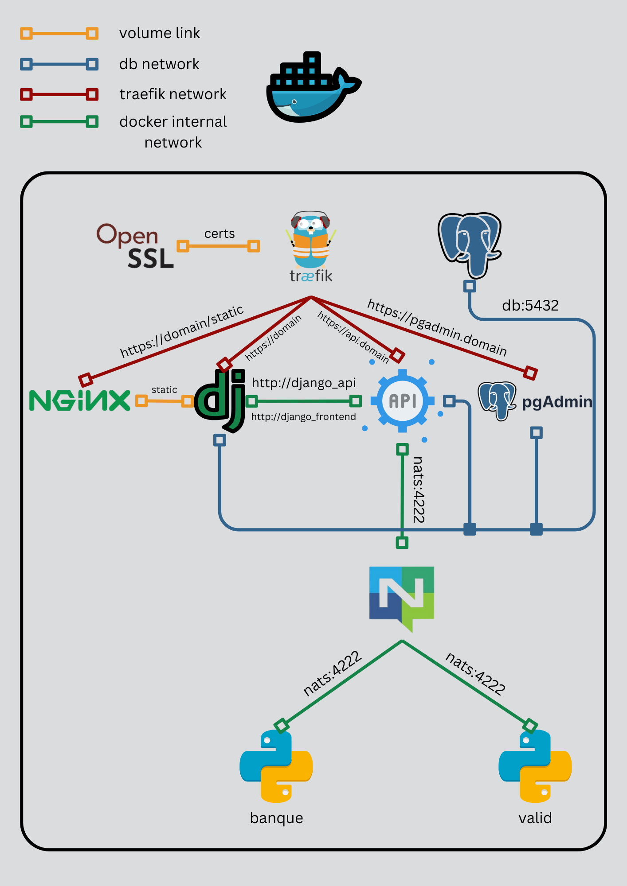
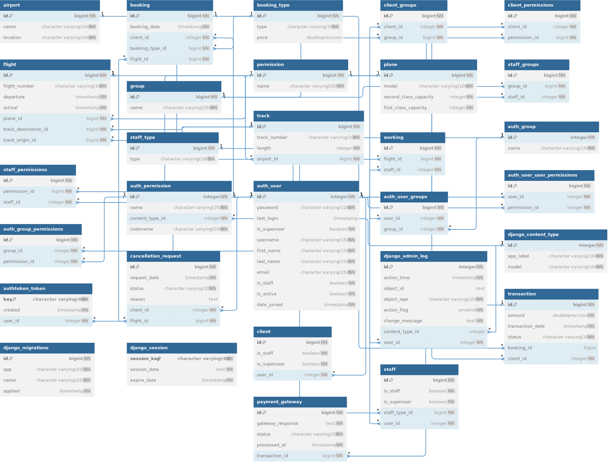

# SAEMicroServices Project

Welcome to the SAEMicroServices project! This document provides an overview of how to set up and run the project in both development and production environments using Docker.

## Development Environment Setup

### Docker-Test Environment

The [`Docker-test`] directory contains the Docker configuration for the development environment. It includes Dockerfiles for the API, Frontend, and other needed services, as well as a [`docker-compose.yml`] file for orchestrating the containers.

#### Setting Up the Environment

1. Copy the [`.env.example`] file in the [`Docker-test`] directory to a new file named `.env` and adjust the environment variables according to your development setup.

    ```sh
    cp Docker-test/.env.example Docker-test/.env
    ```

2. The `.env` file includes configurations for Postgres, PgAdmin, Django, NATS, and Traefik. Make sure to set the `DJANGO_ENVIRONMENT` variable to `test` for the development setup (standalon development of the applications uses `development` but this is when ran outside docker).

3. To start the development environment, navigate to the `Docker-test` directory and run:

    ```sh
    docker-compose up --build
    ```

This will build and start all the necessary containers for the development environment, including the Django API, Frontend, and the required services like Postgres and NATS.

### Accessing the Services

- **Django API**: Accessible at `https://api.your-domain/api/common`
- **Frontend**: Accessible at `https://your-domain`
- **PgAdmin**: Accessible at `https://pgadmin.your-domain`

`your-domain` should be set under the ENV variable `DOMAIN`.

## Production Environment Setup

### Docker Environment

The [`Docker`] directory contains the Docker configuration for the production environment. It includes Dockerfiles for the API, Frontend, and other needed services, along with a [`docker-compose.yml`] file for orchestrating the containers.

The difference between the development and production environments is that the production environment uses nginx to serve static as it uses daphne, an asgi, as a web server and doesn't launch the pgadmin docker.
It also uses the `DJANGO_ENVIRONMENT` variable set to `production` in the `.env` file and secure the `DEBUG_MODE`, `DJANGO_SECRET_KEY`, `DJANGO_ALLOWED_HOSTS`, and `CSRF_ALLOWED_ORIGINS` variables.

#### Setting Up the Environment

1. Copy the [`.env.example`] file in the [`Docker`] directory to a new file named `.env` and adjust the environment variables according to your production setup.

    ```sh
    cp Docker/.env.example Docker/.env
    ```

2. The `.env` file includes configurations for Postgres, Django, NATS, and Traefik. Make sure to set the `DJANGO_ENVIRONMENT` variable to `production` for the production setup.

3. To start the production environment, navigate to the `Docker` directory and run:

    ```sh
    docker-compose up --build
    ```

This will build and start all the necessary containers for the production environment, including the Django API, Frontend, Database, and NATS.

### Accessing the Services

- **Django API**: Accessible at `https://api.your-domain/api/common`
- **Frontend**: Accessible at `https://your-domain`

`your-domain` should be set under the ENV variable `DOMAIN`.

## Additional Notes

- For detailed information on the environment variables and their purposes, refer to the [`Docker-test/.env.example`] and [`Docker/.env.example`] files.
- Ensure that the Docker and Docker-compose are installed on your system to use these configurations.
- The project uses NATS for messaging, Postgres for the database, and Django for both the API and frontend in development. Adjustments may be necessary based on your specific requirements (as an example, you may use real certificates for the production environment).

For more information on the individual components, refer to the README files located in their respective directories.

## Architecture


## Database Architecture

